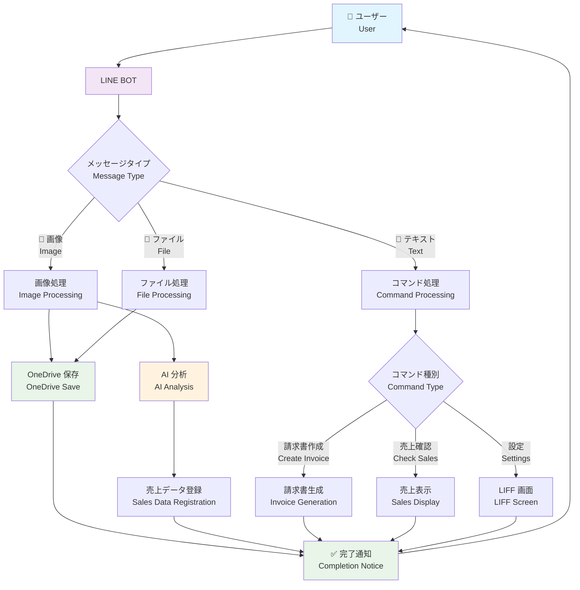
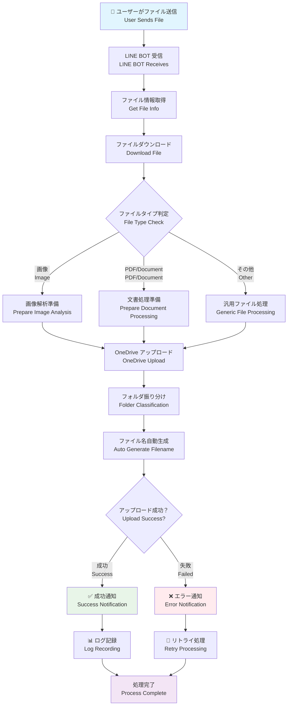
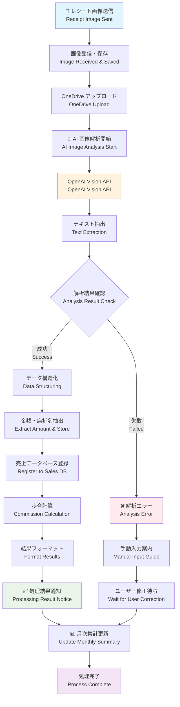
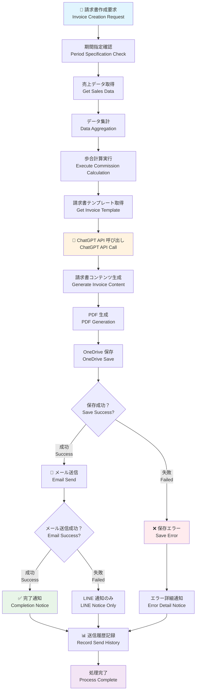
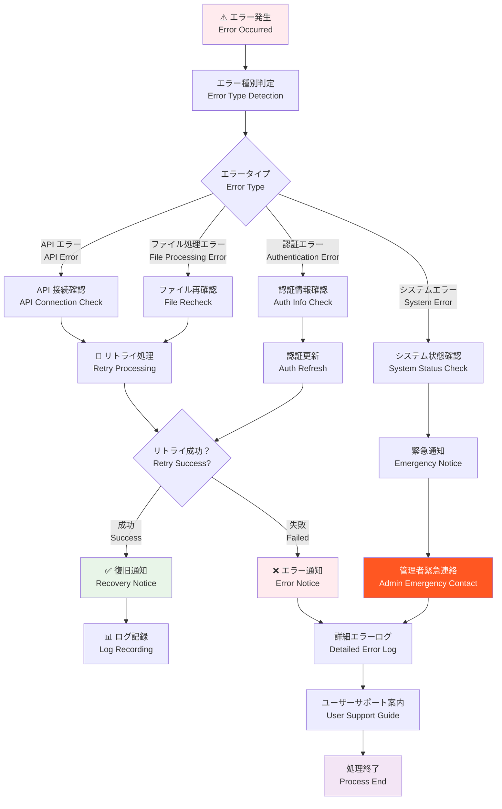

# 処理フロー図 / Process Flow Diagrams 📊

このドキュメントでは、LINE × OneDrive AI業務支援システムの主要な処理フローを図解で説明します。

This document explains the main process flows of the LINE × OneDrive AI Business Support System with diagrams.

## 🗂️ フロー図一覧 / Flow Diagram List

1. [全体システムフロー / Overall System Flow](#overall-system-flow)
2. [ファイルアップロードフロー / File Upload Flow](#file-upload-flow)
3. [レシート処理フロー / Receipt Processing Flow](#receipt-processing-flow)
4. [請求書作成フロー / Invoice Creation Flow](#invoice-creation-flow)
5. [エラーハンドリングフロー / Error Handling Flow](#error-handling-flow)

---

## Overall System Flow

---

## File Upload Flow

---

## Receipt Processing Flow

---

## Invoice Creation Flow

---

## Error Handling Flow

---

## 🔍 フロー図の見方 / How to Read Flow Diagrams

### 記号の意味 / Symbol Meanings

- 🟦 **四角形 / Rectangle**: 処理ステップ / Processing Step
- 🔷 **ひし形 / Diamond**: 判定・分岐 / Decision/Branch
- 🟢 **緑色 / Green**: 成功・完了 / Success/Complete
- 🔴 **赤色 / Red**: エラー・失敗 / Error/Failed  
- 🟡 **黄色 / Yellow**: AI・外部API / AI/External API
- 🔵 **青色 / Blue**: ユーザー操作 / User Action

### 処理の流れ / Process Flow

1. **開始点** から **終了点** まで矢印に従って進みます
2. **判定ポイント** では条件に応じて分岐します
3. **エラー処理** は赤色の経路で示されます
4. **成功処理** は緑色の経路で示されます

Follow the arrows from **start** to **end** points, with **decision points** branching based on conditions, **error handling** shown in red paths, and **successful processing** shown in green paths.