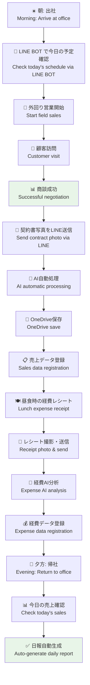
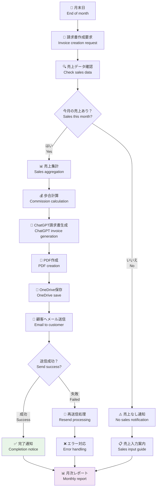
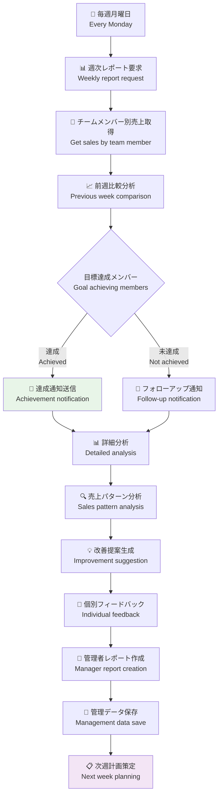
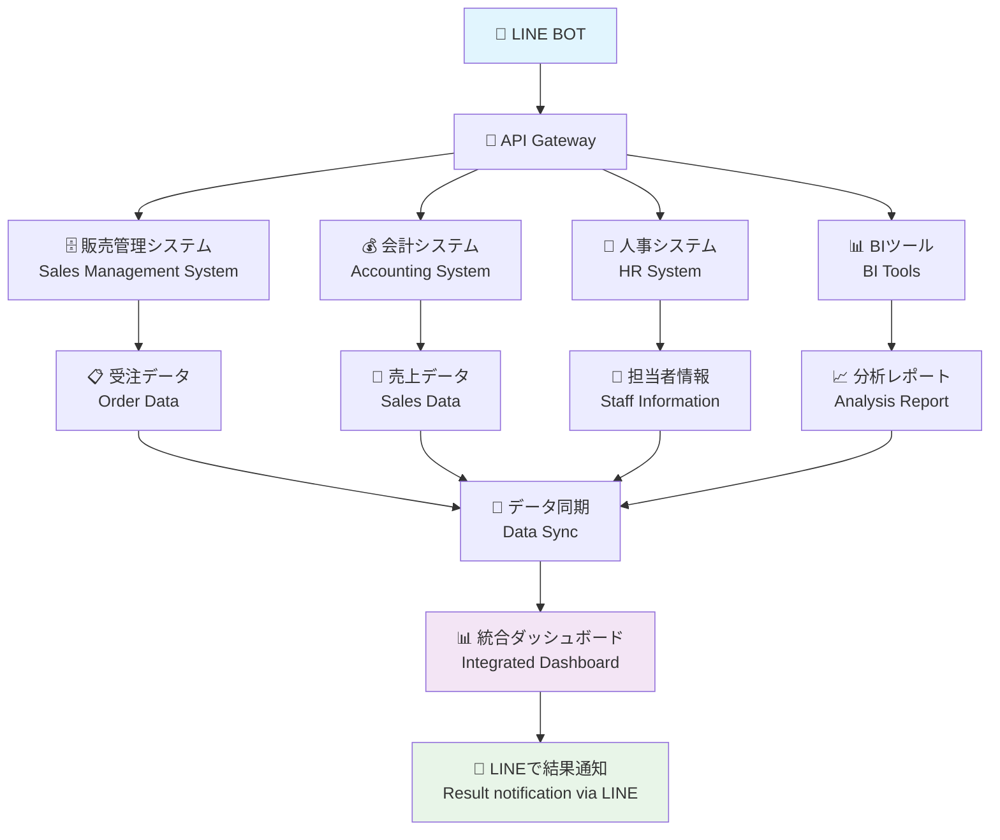
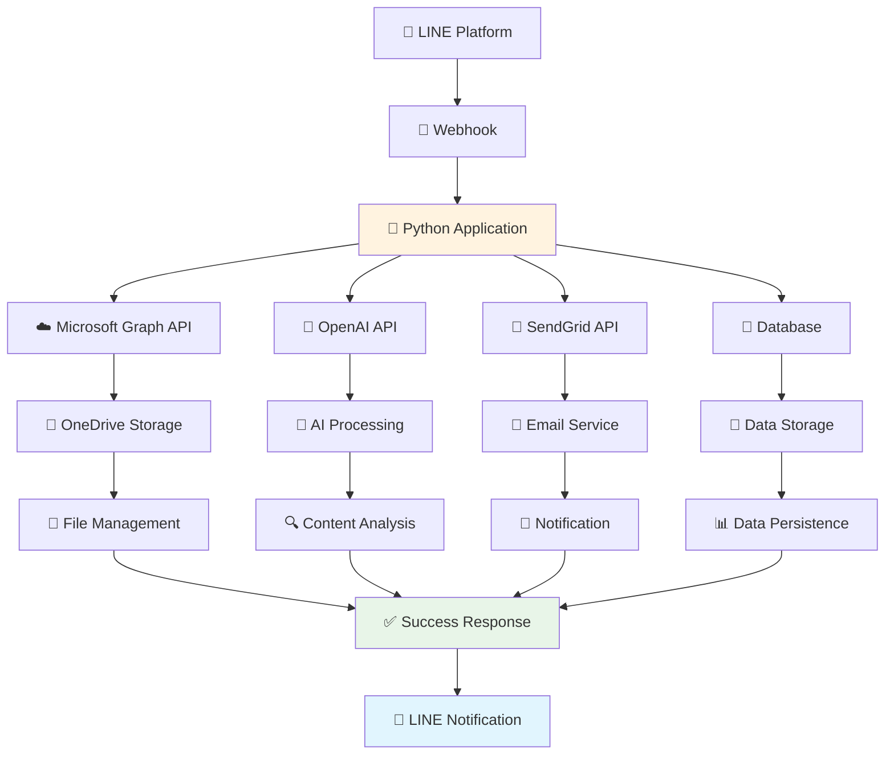
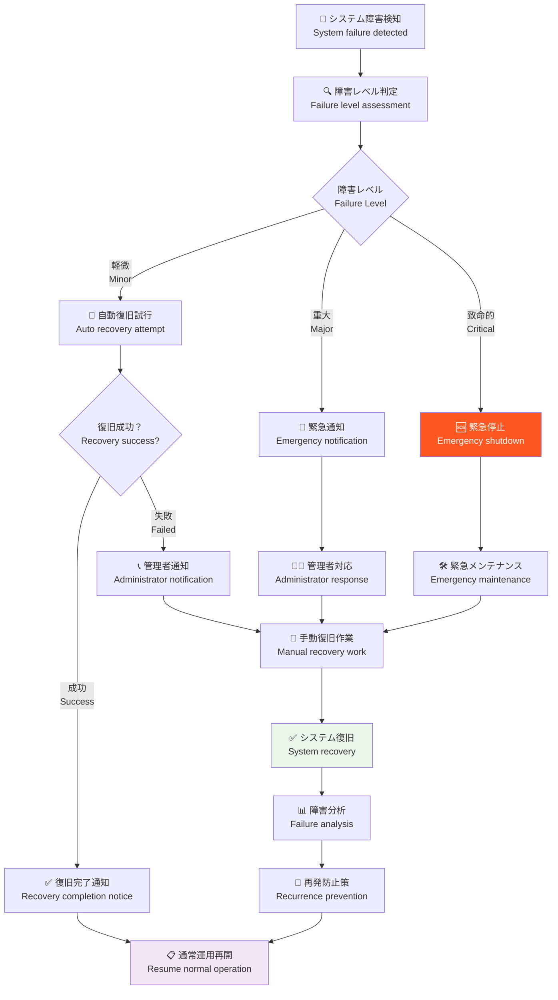
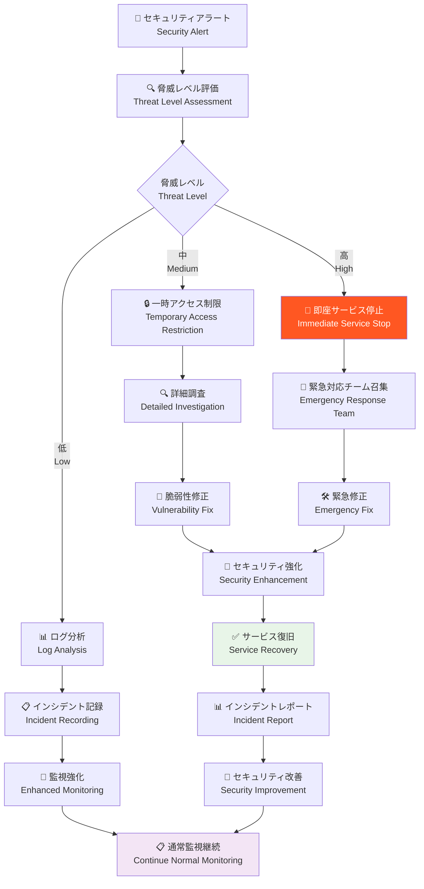

# 詳細シナリオ別フロー図 / Detailed Scenario Flow Diagrams

## ユーザーストーリー別のフロー / User Story Based Flows

### 🍱 シナリオ1: 営業担当者の1日 / Scenario 1: Sales Representative's Day

### 💼 シナリオ2: 個人事業主の月末処理 / Scenario 2: Freelancer's Month-end Processing

### 👥 シナリオ3: チーム管理者の週次確認 / Scenario 3: Team Manager's Weekly Review

## 🔄 システム統合フロー / System Integration Flows

### 🏢 社内システム連携 / Internal System Integration

### ☁️ クラウドサービス連携 / Cloud Service Integration

## 🚨 異常時対応フロー / Exception Handling Flows

### ⚡ システム障害時の対応 / System Failure Response

### 🔐 セキュリティインシデント対応 / Security Incident Response

---

## 📖 フロー図の活用方法 / How to Use Flow Diagrams

### 👥 チーム研修での活用
- 新メンバーへのシステム説明
- 業務プロセスの標準化
- トラブル時の対応手順共有

### 🔧 システム改善での活用
- ボトルネックの特定
- プロセス最適化の検討
- 新機能開発の要件定義

### 📊 監査・レビューでの活用
- セキュリティ監査での手順確認
- 品質管理のプロセス検証
- コンプライアンス確認